```{r setup, include=FALSE}
knitr::opts_chunk$set(echo = TRUE)
```

### 1. INTRODUCTION	

Nowadays, more and more data are collected every day and it is critical to be able to construct meaning from the data. Forecasting has an important part in a variety of fields as a result of the technology advancement. Making predictions and decisions around the unknown future is a topic that is necessary in our complex world, especially when it comes to economics. 

In this project, feed-forward neural networks and recurrent neural networks, which are a subject of deep learning was thoroughly examined. For a better understanding of deep learning, literature research has been done and the history of deep learning was discussed. In the project, especially the mathematical relationships and the related equations were presented. Also, a special type of recurrent neural network for time series, LSTM was explored in depth.

In application, the data set containing 44 county pairs, export values for each country pair, and several factors that may affect export values, was examined. The dataset and the meaning of those factors were thoroughly discussed.

The main purpose of the project is to investigate export values change over time and to predict the future. For that reason, several models have been built on Python. Three models have been built using LSTM and the other three models have been built with feed-forward neural network. 
In order to determine the optimal model for data set, model error values have been compared and regarding this comparison, the discussion has been made.  

### 2. AN OVERVIEW OF DEEP LEARNING

The history of deep learning goes back to McCulloch & Pitts paper published in 1943. According to the study, what makes a human brain a computational device is the neural activity in the mind. Taking this into consideration, deep learning algorithms have been influenced by human brains, which can understand complicated information.

If a network has enough number of neurons and has a proper synaptic connection, then it can compute any value. In this case, a simple logic function will be applied depending on the weights in the McCulloch & Pitts neuron. Furthermore, the concept of threshold is an important feature. For a precise neuron, if the net input which is the weighted sum of the inputs is greater than a certain threshold then the neuron will be fired.

In 1949, Hebb published a book called “The Organization of Behavior”. Hebb suggested that the brain's connectivity is constantly changing as an organism while learning different functional tasks. The idea behind Hebb's theory is that if two neurons are found to be active at the same time, fired together, the strength of the connection between them should be increased. The strength of the connection between neurons will be changed while learning.

Tasks such as learning to classify labeled examples and recognition of distinct patterns were performed by the term called perceptron. Perceptron is the method for iterative weight arrangement, therefore the weights on the connection paths can be improved. Rosenblatt proved a theorem that the learning algorithm can find the right answer if there was a sufficient set of parameters for classifying and there were adequate number of examples. However, in the 1950s the perceptron learning algorithm was needed for digital computers to compute with real numbers which were carried out insufficiently at that time.

Deep learning networks allow communication between computers and human beings while being a bridge between digital and daily life. In other words, it provides a balance between real word which is complex and indefinite with a word with symbols and rules.  

### 3. NEURAL NETWORKS  
In this section, we closely followed the book titled “An Introduction to Statistical Learning with Application in R” by Gareth James, Daniela Witten, Trevor Hastie, Robert Tibshirani.  

#### 3.1. Single Layer Neural Networks  
For predicting the response Y, a neural network will build nonlinear function $\small \vec{X} \to Y$ where $\small X$ is input vector of $\small n$ number of variables $\small \vec{X} =(X_1,X_2,...,Xn)$. These input units will affect the model’s result.  

<center>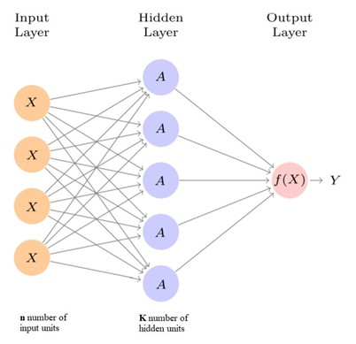</center>  

_Figure 1_ shows feed-forward neural network with single layer. The input vector $\small \vec{X}$ will create input layer neurons in the neural network. Each unit from the input layer will feed the hidden layer network which has K hidden units. In this layer, the units are neither inputs nor outputs, that is why it is called hidden.  
$$f(X)=β_0+\sum_{k=1}^Kβ_k h_k (X) $$  
$$=β_0+\sum_{k=1}^Kβ_k g(w_0k+\sum_{i=1}^nw_{ik} X_i).$$
In Equations above, $\small w_{11},…,w_{nK}$ indicate weights flow through input layer to hidden layer. Similarly, $\small β_1,β_2,…,β_K$ indicate weights flow through hidden layer to output. $\small β_0$ and $\small w_{0k}$ are the bias terms. First index of $\small w$ shows that which neuron in the input layer will feed into the hidden layer. Second index of $\small w$ shows which neuron in the hidden layer feeded up.

$\smallβ$  and $\small w$ parameters must be estimated from data. 

##### 3.1.1. Activation Function 

Nonlinearity is included to a neuron through activation function that is crucial for finding a solution of complex neural network problems. If nonlinearity in the activation function is not applied, network model turns into a simple linear regression model. Also, the nonlinearity of the activation function provides better reflection of complex data.

$\small A_k$ are the neurons in the hidden layer. $\small h_k (X)$ is the function that builds $\small A_k$ with input features. $\small g(t)$ is an activation function that is nonlinear in advance:  
$$A_k= h_k(X)=g(w_{0k}+\sum_{i=1}^nw_{ik} X_i).$$
$\small f(X)$  function will be computed with weights $\small β_k$ and the activations $\small A_k$ from hidden layer pass into the output layer: 

$$f(X)= β_0+\sum_{k=1}^Kβ_k A_{k}. $$  

##### 3.1.2. Squared-Error Loss

Squared error function is commonly used to estimate efficiency of the neural network model. It is used to compare the predicted value with the actual value where $\small f(x_i)$ is the prediction and $\small y_i$ is the $\small i^{th}$ observation. The unknown parameters such as biases and weights are determined to minimize

$$\sum_{i=1}^n(y_i-f(x_i ))^2,$$  
while fitting the model.  

#### 3.2. Multilayer Neural Networks

A large size single hidden layer is theoretically sufficient to make an acceptable approximation. Nevertheless, more than one hidden layer with small size returns good results much more easily.  
<center>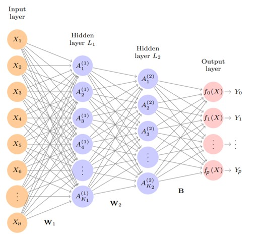</center>  

Apart from the number of layers, the difference between _Figure 1_ and _Figure 2_ is the number of results. In single layer neural network there were one output, however in this example, in two hidden layer neural network there are p number of outputs. Nevertheless, it is not necessary to have multiple outputs.

Similarly to single layer neural network, the activation function applied from input layer to first hidden layer:

$$A_k^{(1)}  = h_k^{(1)}(X) = g(w_{0k}^{(1)}+\sum_{i=1}^nw_{ik}^{(1)} X_i), $$  
for $\small k=1,2,…,K_1.$  

First hidden layer activations $\small A_k^{(1)}$ will be treated as inputs for the second hidden layer activations:   
$$A_l^{(2)}  = h_l^{(2)}(X) = g(w_{0l}^{(2)}+\sum_{k=1}^{K_1}w_{kl}^{(2)} A_k^{(1)})$$  
for $\small l=1,2,…,K_2.$  

Each of the activation functions, are function of $\small \vec{X}$ input vector. After sequences of transformations, the network will generate complex $\small \vec{X}$ transformations which are fed as features into the output layer.  

At the output layer there are p number of results. The function is 
$$f_m (X)=β_{0m}+\sum_{l=1}^{K_2}β_{lm}h_l^{(2)}(X)=β_{0m}+\sum_{l=1}^{K_2}β_{lm}A_l^{(2)},$$
while $\small m=1,2,…,p$ if all these results are different.  

### 4. RECURRENT NEURAL NETWORKS

While working with documents, such as reviews and articles, or time-series data; remembering previous words or values might be necessary. In such cases, it is important to not start from scratch each time. Therefore, understanding previous data points is crucial. Recurrent neural networks (RNNs) allow information to carry on using loops. The feed-forward neural networks are meant for independent data points, and they are not capable of holding previous information. 
<center>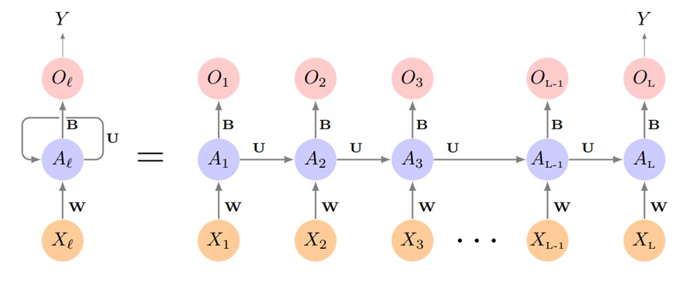</center>

In _Figure 3_, $\small \{X_l\}_1^L$ are the sequence of input vectors and $\small Y$ is the target which is a single response. The recurrent neural network will sequentially go through input sequence $\small X$. Each input $\small X_l$ will feed into the hidden layer such as a feed-forward neural network. The difference between feed-forward and recurrent neural networks is the hidden layer $\small A_l$ will also take the activation function $\small A_{l-1}$  from the previous step as input. **W,U** and **B** weights used when each of the elements was processed. At each step, $\small O_l$ will be created from each activation function $\small A_l$. The $\small O_L$ is the most relevant one since the target single response will be the result of the last step $\small O_L$.  

$\small X_l$ has $\small p$ units and hidden layer has $\small K$ units:  
$$X_l^T  = (X_{l1},X_{l2},...,X_{lp}),$$  
$$A_l^T= (A_{l1},A_{l2},...,A_{lK}).$$  
Then the main equation for each activation function will follow 

$$A_{lk}  = g (w_{k0}+\sum_{j=1}^pw_{kj}X_{lj}+\sum_{s=1}^Ku_{ks} A_{l-1,s}),$$  
and the $\small O_l$ output for each layer will be calculated as  
$$O_l  = β_0+\sum_{k=1}^Kβ_kA_{lk}.$$  

#### 4.1. Disadvantages of Recurrent Neural Networks

Each weight in the network is updated using stochastic gradient descent. By taking the first prediction error of the model, it estimates a gradient. This gradient updates the weights so that less error is made next time, and it goes through the network from the output layer to the input layer. This process is called backward propagation.

In most cases, it is desirable to work with many layers in a neural network since it presents better learning from large training datasets and increases on capacity of the network. However, when propagated backward through the network the gradient vanishes since there are many layers. When a gradient value becomes extremely small, it no longer contributes to learning.

The equation of gradient descent algorithm will follow  
$$w^+=w- α\frac{∂Error}{∂w},$$  
where $\small w^+$ is updated weight, $\small w$ is weight, $\small α$ is learning rate, $\small \frac{∂Error}{∂w}$  is the gradient.  

In recurrent neural networks (RNNs), because of the small gradient, earlier layers of the network will stop learning. In this case, the first layers of the network will not learn and RNN will forget what the first inputs are, which are expressed as short-term memory. Therefore, using RNN might not be desirable.  

### 5. LONG SHORT-TERM MEMORY

In this section, we closely followed the blog titled “Understanding LSTM Networks” by Christopher Olah. Additionally, all figures in this chapter are taken from the blog.

Long Short-Term Memory (LSTM), which is a type of recurrent neural network, is broadly similar to the logic gates of a computer. LSTM can prevent long-term dependency problems with the concept of “memory cell”. In the RNN structure, there is only one activation function as seen in _Figure 4_. 
<center>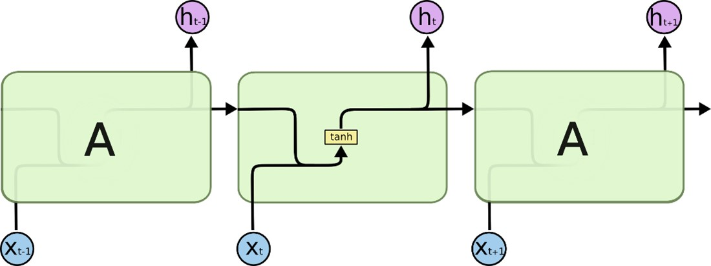</center>

However, the LSTM structure is more complex than RNNs as in _Figure 5_. An LSTM cell includes three gates called input gate, forget gate, output gate, and one cell state. Additionally, there are two activation function such as tanh and sigmoid.  
<center>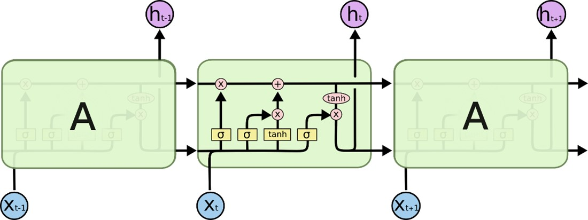</center>

The sigmoid function scales values between 0 and 1,
$$σ(x)=  \frac{e^x}{(1+ e^x)}=  \frac{1}{(1+ e^{-x})}.$$  
The tanh function scales values between -1 and 1,
$$tanh(x) = \frac{e^x-e^{-x}}{e^x+ e^{-x}}.$$    

#### 5.1. Cell State

The key part of the LSTM is the horizontal line flowing through the cell which is called cell state as seen in _Figure 6_. The flowing information can be removed, or new information can be added to the cell state by the term called gates. The gates will have outputs, and the cell state will be updated according to these outputs by the flow ability.

<center>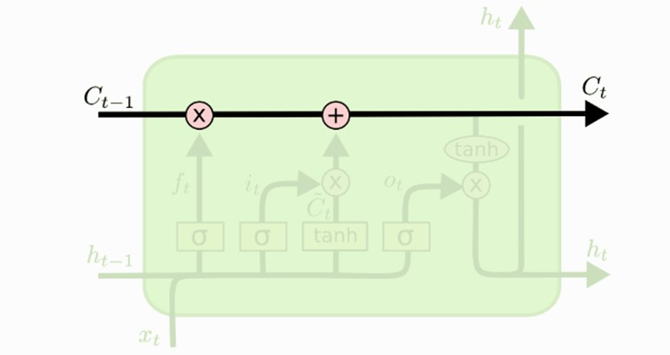</center>

<center><p>$\small C_{t-1}:$ previous cell state, $\small C_t:$ current cell state </p> </center>  
$\small C_{t-1}$ is the cell state that coming from the previous cell. This  $\small C_{t-1}$  will updated through current cell and will give the new cell state $\small C_t$.

#### 5.2. Gates

LSTM has three gates to decide which information will flow through and which unnecessary information will be removed. In this way, gates will control the cell state. 
  
##### 5.2.1. Forget Gates

In the first step of LSTM, forget gate decides which information should be removed from the cell state. To achieve this, the sigmoid function is used which converts values between 0 and 1 for each number in the cell state $\small C_{t-1}$. The output value is calculated from the previous hidden state value $\small h_{t-1}$ and new input value $\small x_t$. Output 0 implies that it should be definitely removed from the cell state and output 1 implies it should be definitely kept in the cell state.  
<center>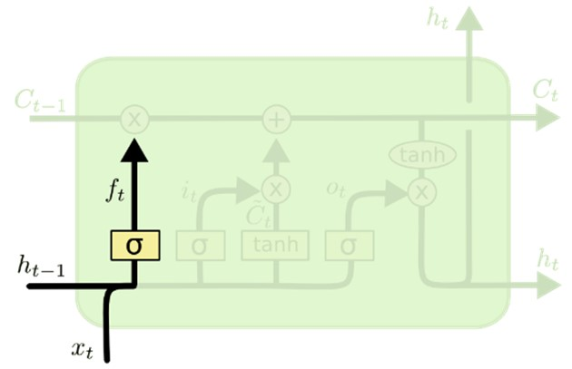</center>  
<center>$\small h_{t-1}:$previous hidden state, $\small x_t:$new input, $\small σ:$sigmoid function, $\small f_t:$forget gate output </center><br>
  
The forget gate output will be computed with  
  
$$f_t= σ(W_f∙(h_{t-1}+x_t) + b_f ),$$
where $\small W_f$ is weight and $\small b_f$ is bias of forget gate. Later, $\small f_t$ will be used to determine current cell state $\small C_t$.  

##### 5.2.2. Input Gates

The input gate decides which new information will be added to the cell state. In the input gate, there are two layers, sigmoid and tanh functions. tanh layer will create new candidate values $\small \tilde{C_t}$  that have the potential to be added to the cell state while converting values between -1 and 1. Furthermore, similar to the case in forget gate, the input gate will choose what information is going to be stored with the help of the sigmoid function while converting values between 0 and 1. Therefore, the sigmoid function will decide which information will be added by looking at the candidate values $\small \tilde{C_t}$.  
<center>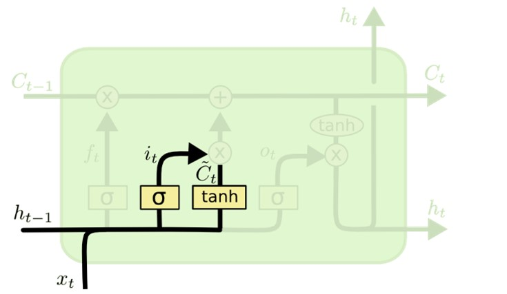</center> <center> 
$\small h_{t-1}:$previous hidden state, $\small x_t:$ new input, $\small tanh:$tanh⁡function, $\small \tilde{C_t}:$candidate, $\small σ:$sigmoid function, $\small i_t:$input gate output  </center><br>

Therefore, based on the information provided above, the input gate output $\small i_t$ and the candidate value $\small \tilde{C_t}$ computed as  
$$ i_t= σ(W_i∙(h_{t-1}+x_t )+ b_i ),$$
$$\tilde{C_t} =tanh⁡(W_C∙(h_{t-1} + x_t )+ b_C).$$  
In the next step, with the outputs of the input and forget gates, the old cell state $\small C_{t-1}$   will be updated into new cell state $\small C_t$ as seen in _Figure 9_. The calculation is done by multiplying the old cell state by the forget output, which means that the ones chosen will be forgotten from the old state. Also, candidate values are multiplied by input gate output values to select from new candidate values to be added to new cell state. When these two multiplication added together, the current cell state equation obtained as  
$$ C_t=f_t*C_{t-1}+ i_t*\tilde{C_t}$$
<center>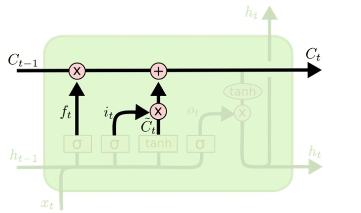</center>  
<center>
$\small f_t:$forget gate output, $\small C_{t-1}:$ previous cell state, $\small i_t:$input gate output, $\small \tilde{C_t}:$candidate, $\small C_t:$new cell state </center><br>

##### 5.2.3. Output Gates

Lastly, the output will be computed in the output gate. In the output gate, again, the sigmoid function will decide what information to get from the cell state. The output gate output calculated as 
$$O_t= σ(W_O∙(h_{t-1}+x_t )+ b_O ).$$
The tanh function will filter the current cell state $\small C_t$ between -1 and 1. The output will depend on current cell state $\small C_t$ as shown in: 
$$ h_t= O_t  ×  tanh⁡(C_t ).$$
Output of the output gate $\small O_t$  and $\small tanh$ of current cell state $\small C_t$  multiplication will give the new hidden state $\small h_t$ as seen in above. After this process, the hidden state will feed the next cell in the next step. 
<center>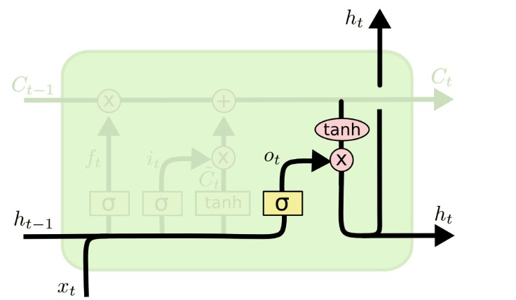</center>  
<center> $\small h_{t-1}:$previous hidden state, $\small x_t:$new input, $\small σ:$sigmoid function, $\small tanh:$tanh ⁡function, $O_t:$output gate output, $h_t:$hidden state
</center><br>  

### 6. MODEL BUILDING

#### 6.1. Libraries Used

The Python libraries showed in the Table 1 are essential to be able to use particular functions.<br>  
<style>
table {
  text-align:center;
  font-family: arial, sans-serif;
  border: 1px solid black;
  border-collapse: collapse;
  width: 100%;
}

td{
  text-align:left;
  border: 1px solid black;
  padding: 8px;
}
th {
  text-align:center;
  border: 1px solid black;
  padding: 8px;
}
tr:nth-child(even) {
  background-color: #dddddd;
}
</style>
<table class="center" >
  <tr>
    <th>Libraries      </th>
    <th>Description</th>
  </tr>
  <tr>
    <td>NumPy</td>
    <td>NumPy is the essential package for scientific computing such as linear algebra.</td>
  </tr>
  <tr>
    <td>pandas</td>
    <td>Pandas is an open-source data analysis and manipulation tool built on the Python programming language.</td>
  </tr>
  <tr>
    <td>math</td>
    <td>For mathematical functions, math library is used.</td>
  </tr>
  <tr>
    <td>tensorflow</td>
    <td>TensorFlow is an open-source library which is used mainly for deep learning applications.</td>
  </tr>
  <tr>
    <td>sklearn</td>
    <td>Sklearn library is essential for machine learning applications and statistical modeling in term of tools for classification and regression.</td>
  </tr>
  <tr>
    <td>keras</td>
    <td>Keras which runs on top of the TensorFlow is used for evaluating deep learning models such as artificial neural networks.</td>
  </tr>
  <tr>
    <td>matplotlib</td>
    <td>Matplotlib is useful library for data visualization and graphical plotting.</td>
  </tr>
</table>
<center><p> _Table 1: Python libraries used._ </p></center>   
#### 6.2. The Dataset  
The dataset includes several countries and their export values as time series. The dataset has been created with 44 country pairs and a total of 12 countries. Additionally, some factors that may be related to export values such as distance between country pairs, GDP value of each country, and more, were collected. For this project, 20 years from 2000 to 2019 are chosen to work with.

The European Free Trade Association (EFTA) is an organization run by four members, Iceland, Liechtenstein, Norway, and Switzerland to promote free trade and economic integration for the benefit of its members. 

A Free Trade Agreement (FTA) is a type of trade agreement between countries to lower trade barriers. The EFTA countries intended to contribute to the growth of international trade. For that reason, in 1991, FTA has been signed between the Republic of Turkey and EFTA States.  

In this project, the export values of EFTA countries and Turkey have been considered and taken from the World Bank which gave in US$ thousand. Unfortunately, Liechtenstein was not included since there were no data about its export values on [World Integrated Trade.](https://wits.worldbank.org/CountryProfile/en/Country/TUR/StartYear/2000/EndYear/2019/TradeFlow/Export/Partner/BY-COUNTRY/Indicator/XPRT-TRD-VL)  

Norway, Switzerland, Iceland, and Turkey were taken as exporting countries. The export values between exporting countries and several importing countries were analyzed. The import countries were taken as China, Netherlands, United States of America, United Kingdom, Spain, Italy, Germany, France, Norway, Switzerland, Iceland, and Turkey.

Developing economies can benefit from international trade more. Considering that, there is a positive correlation between trade and economic size. Thus, the gross domestic product (GDP) and the gross domestic product per capita (GDPPC) data in US$ for individual countries were taken from [The World Bank’s database.](https://databank.worldbank.org/indicator/NY.GDP.MKTP.CD/1ff4a498/Popular-Indicators)  
Due to transportation costs, trade is more reasonable when distances are shorter. Therefore, the distance between capital cities of countries has been taken in kilometers from [European Union website](https://erasmus-plus.ec.europa.eu/resources-and-tools/distance-calculator), and after, an excel file has been created to work on.

After taking data from several resources, the data has been converted as seen in _Table 2_ with data wrangling in Python.  


<style>
table {
  text-align:center;
  font-family: arial, sans-serif;
  border: 1px solid black;
  border-collapse: collapse;
  width: 100%;
}

td{
  text-align:left;
  border: 1px solid black;
  padding: 8px;
}
th {
  text-align:center;
  border: 1px solid black;
  padding: 8px;
}
tr:nth-child(even) {
  background-color: #dddddd;
}
</style>
<table class="center" >
  <tr>
    <th>Column Name     </th>
    <th>Description</th>
    <th>Type</th>
  </tr>
  <tr>
    <td>Export</td>
    <td>The exporting country $\small i$</td>
    <td>Categorical</td>
  </tr>
  <tr>
    <td>Import</td>
    <td>The importing country $\small j$</td>
    <td>Categorical</td>
  </tr>
  <tr>
    <td>Year</td>
    <td>Year $\small t$</td>
    <td>Numerical</td>
  </tr>
  <tr>
    <td>Export_Value</td>
    <td>The export of country $\small i$ to country $\small j$ in year $\small t$</td>
    <td>Numerical</td>
  </tr>
  <tr>
    <td>Export_Value_(t-1)</td>
    <td>The export of country $\small i$ to country $\small j$ in year $\small t-1$</td>
    <td>Numerical</td>
  </tr>
  <tr>
    <td>GDP_i(t-1)</td>
    <td>The Gross Domestic Product of country $\small i$ in year $\small t-1$</td>
    <td>Numerical</td>
  </tr>
  <tr>
    <td>GDP_j(t-1)</td>
    <td>The Gross Domestic Product of country $\small i$ in year $\small t-1$</td>
    <td>Numerical</td>
  </tr>
    <tr>
    <td>GDPPC_i(t-1)</td>
    <td>The Gross Domestic Product of country $\small j$ in year $\small t-1$</td>
    <td>Numerical</td>
  </tr>
    <tr>
    <td>GDPPC_j(t-1)</td>
    <td>The per capita Gross Domestic Product of country $\small j$ in year $\small t-1$</td>
    <td>Numerical</td>
  </tr>
    <tr>
    <td>D_ij</td>
    <td>The distance in km between the capital cities of country $\small i$ and $\small j$</td>
    <td>Numerical</td>
  </tr>
  <tr>
    <td>FTA_1</td>
    <td>Dummy variable which takes value of 1 if both countries were members of EFTA-Turkey FTA</td>
    <td>Numerical</td>
  </tr>
    <tr>
    <td>FTA_2</td>
    <td>Dummy variable which takes value of 1 if the exporting country $\small i$ was a member of EFTA-Turkey FTA but the importing country $\small j$ did not belong to EFTA-Turkey FTA</td>
    <td>Numerical</td>
  </tr>
</table>
<center><p> _Table 2: Columns and their description after tidying dataset._ </p></center> 

#### 6.3. Data Wrangling

In order to obtain the data as in _Table 2_, data wrangling should be done. In this project, data 
wrangling is made with Python. 

Throughout this section, the data frames are displayed using the head function for a better understanding of the changes. The head function shows the data frame's first five rows.

Firstly, libraries are imported.  
```{r, eval=F, echo=T}
import numpy as np
import pandas as pd

```
The data sets that contain each EFTA-Turkey FTA country's export values over the years are imported.

```{r, eval=F, echo=T}
iceland_export = pd.read_excel("data/iceland_exp.xlsx",
                                sheet_name='Partner-Timeseries')
switzerland_export = pd.read_excel("data/switzerland_exp.xlsx",
                                    sheet_name='Partner-Timeseries')
norway_export = pd.read_excel("data/norway_exp.xlsx",
                               sheet_name='Partner-Timeseries')
turkey_export = pd.read_excel("data/turkey_exp.xlsx",
                               sheet_name='Partner-Timeseries')
```

<center>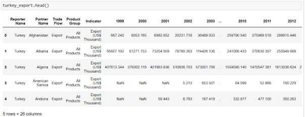</center>

In the data frames, year columns should be converted into rows. Therefore, to unpivot the data frames, the melt function is used. In this way, each year will become rows and the export value of the country in that year will be in the same row.  
```{r, eval=F, echo=T}
years_export = ['1999','2000', '2001', '2002', '2003', '2004', '2005',
                '2006', '2007', '2008', '2009', '2010', '2011', '2012',
                '2013', '2014', '2015', '2016', '2017', '2018', '2019']

turkey_export = turkey_export.melt(id_vars=['Reporter Name','Partner
                                             Name'], value_vars=years_export, var_name='Year',
                                             value_name ='Export_Value')
norway_export = norway_export.melt(id_vars=['Reporter Name','Partner
                                             Name'], value_vars=years_export, var_name='Year',
                                             value_name='Export_Value')
iceland_export = iceland_export.melt(id_vars=['Reporter Name','Partner
                                               Name'], value_vars=years_export, var_name='Year',
                                               value_name='Export_Value')
switzerland_export = switzerland_export.melt(id_vars=['Reporter Name',
                                                      'Partner Name'], value_vars=years_export,
                                                       var_name='Year', value_name='Export_Value')
```

<center>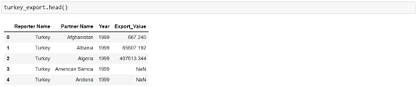</center>

Firstly, the names of columns have been renamed. In each country’s data frame, there are data for all countries they import to. Therefore, for each data frame, the decided importing countries are filtered. And since, the exporting countries are also importing countries, for each data frame a new importing country list should have been created. 
```{r, eval=F, echo=T}
turkey_export.rename(columns = {'Reporter Name' : 'Export', 'Partner 
                                 Name' : 'Import'}, inplace = True)
turkey_imp_country = ['China', 'France', 'Germany', 'Iceland', 'Italy',
                      'Netherlands', 'Norway', 'Spain', 'Switzerland', 'United Kingdom', 'United                              States']
turkey_export = turkey_export.loc[turkey_export['Import'].isin(turkey_imp_country)]
```


```{r, eval=F, echo=T}
switzerland_export.rename(columns = {'Reporter Name' : 'Export', 'Partner
                                      Name' : 'Import'}, inplace = True)
switzerland_imp_country = ['China', 'France', 'Germany', 'Iceland',
                           'Italy', 'Netherlands','Norway', 'Spain',
                           'Turkey', 'United Kingdom', 'United States']
switzerland_export = switzerland_export.loc[switzerland_export['Import'].isin(switzerland_imp_country)]
```

```{r, eval=F, echo=T}
norway_export.rename(columns = {'Reporter Name' : 'Export', 'Partner
                                 Name' : 'Import'}, inplace = True)
norway_imp_country = ['China', 'France', 'Germany', 'Iceland', 'Italy',
                      'Netherlands', 'Spain', 'Switzerland', 'Turkey',
                      'United Kingdom', 'United States']
norway_export = norway_export.loc[norway_export['Import'].isin(norway_imp_country)]
```


```{r, eval=F, echo=T}
iceland_export.rename(columns = {'Reporter Name' : 'Export', 'Partner
                                  Name' : 'Import'}, inplace = True)
iceland_imp_country = ['China', 'France', 'Germany', 'Italy',
                       'Netherlands', 'Norway', 'Spain', 'Switzerland',
                       'Turkey', 'United Kingdom', 'United States']
iceland_export=iceland_export.loc[iceland_export['Import'].isin(iceland_imp_country)]
```

<center>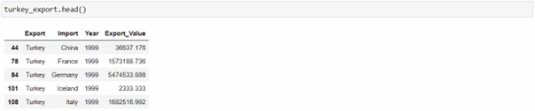</center>
<br>
4 data sets containing export data of Turkey, Norway, Switzerland, and Iceland, respectively, are concatenated using the concat function.  

```{r, eval=F, echo=T}
export_data_all = pd.concat([turkey_export, norway_export,
                             switzerland_export, iceland_export]).reset_index()
                            .drop(labels='index', axis=1)
```

Object columns, "Year" and "Export_Value", is converted to numeric columns.  
```{r, eval=F, echo=T}
export_data_all["Year"] = pd.to_numeric(export_data_all["Year"])
export_data_all["Export_Value"] = pd.to_numeric(export_data_all
                                  ["Export_Value"])

```

The data set is separated into two as export_data_1999 and export_data for specifically the year 1999 and the rest, respectively. Since 1999 year will be used only for the previous year's export value, the main data frame will include 2000-2019 which is called export_data.  
```{r, eval=F, echo=T}
export_data_1999 = export_data_all[export_data_all['Year'] == 1999]
export_data = export_data_all[export_data_all['Year'] != 1999]
```
After export_data is created, data set that contains GDP and GDPPC values of each country over the years is imported. Values after the 24th row are not taken, since they are nonmeaningful rows.  
```{r, eval=F, echo=T}
gdp_gdppc = pd.read_csv("data/gdp_gdppc.csv")
gdp_gdppc = gdp_gdppc[:24]
```
<center>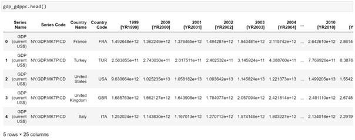</center>
Firstly, the melt function is used to unpivot the data frame to make year columns into rows.  
```{r, eval=F, echo=T}
years_gdp_gdppc = ['1999 [YR1999]', '2000 [YR2000]', '2001 [YR2001]',
'2002 [YR2002]', '2003 [YR2003]', '2004 [YR2004]', '2005 [YR2005]', '2006 [YR2006]',
'2007 [YR2007]', '2008 [YR2008]', '2009 [YR2009]', '2010 [YR2010]', '2011 [YR2011]',
'2012 [YR2012]', '2013 [YR2013]', '2014 [YR2014]', '2015 [YR2015]', '2016 [YR2016]',
'2017 [YR2017]', '2018 [YR2018]', '2019 [YR2019]']
gdp_gdppc = gdp_gdppc.melt(id_vars=['Country Name','Series Name'],
                           value_vars = years_gdp_gdppc, var_name='Year', 
                           value_name='Value')
```
<center>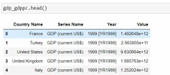</center>  
To arrange the 'Year' column, last 9 characters are deleted in the string.  
```{r, eval=F, echo=T}
gdp_gdppc['Year'] = gdp_gdppc.apply(lambda row: row['Year'][:-9], axis=1)
```

